

## Getting Started with Apache Spark

<a href="https://www.catallaxyservices.com">Kevin Feasel</a> (<a href="https://twitter.com/feaselkl">@feaselkl</a>)
<a href="https://csmore.info/on/spark">https://CSmore.info/on/spark</a>

---

@title[Who Am I?]

@snap[west splitscreen]
<table>
	<tr>
		<td></td>
		<td><a href="https://csmore.info">Catallaxy Services</a></td>
	</tr>
	<tr>
		<td></td>
		<td><a href="https://curatedsql.com">Curated SQL</a></td>
	</tr>
	<tr>
		<td></td>
		<td><a href="https://wespeaklinux.com">We Speak Linux</a></td>
	</tr>
</table>
@snapend

@snap[east splitscreen]

	
	 
	<a href="https://www.twitter.com/feaselkl">@feaselkl</a>

@snapend

---

@title[The Origins Of Spark]

## Agenda

1. **The Origins of Spark**
2. Installing Spark
3. Functional Spark
4. Our First Examples
5. Spark SQL
6. Databricks Cloud

---

### The Origins of Hadoop

Hadoop started as a pair of Google whitepapers: the Google File System (released in 2003) and MapReduce (2004). Doug Cutting, while working at Yahoo, applied these concepts to search engine processing.  The first public release of Hadoop was in early 2006.

Since then, Hadoop has taken off as its own ecosystem, allowing companies to process petabytes of data efficiently over thousands of machines.

---

### Great Use Cases for Hadoop

* Processing gigantic numbers of records, where a single-server solution is cost prohibitive or unavailable.
* "Cold storage" of relational data, especially using Polybase.
* Real-time ETL and streaming of data.
* Statistical analysis of gigantic data sets.
* A central data repository (data lake), which can feed other sources (like warehouses).

---

### The Birth of Hadoop:  2007-2011

The hardware paradigm during the early Hadoop years:

* Lots of off-the-shelf servers with direct attached storage.
* Storage was primarily spinning disk.
* Servers were held on-prem.
* Servers were phyiscal machines.
* There was some expectation of server failure.

This hardware paradigm drove technical decisions around data storage, including the Hadoop Distributed Filesystem (HDFS).

---

### The Birth of Hadoop:  2007-2011

The software paradigm during the early Hadoop years:

* On Linux, C is still popular, but Java is cross-portable.
* RAM is much faster than disk but is limited.
* Network bandwidth is somewhat limited.
* Data structure is context-sensitive and the same file may have several structures.
* Developers know the data context when they write their code.

This drove a number of decisions, including node types, semi-structured data storage, and MapReduce.

---

### Node Types in Hadoop

There are two primary node types in Hadoop: the NameNode and data nodes.

The **NameNode** is also known as the control node or the head node. It is responsible for communication with the outside world, coordination with data nodes, and ensuring that jobs run.

**Data nodes** store data and run code. After running the code against chunks of data, they return results back to the NameNode to make available to the user.

---

### Data Retrieval in Hadoop

Hadoop follows a "semi-structured" data model: you define the data structure not when adding files to HDFS, but rather upon retrieval. You can still do ETL and data integrity checks before moving data to HDFS, but it is not mandatory.

In contrast, a relational database has a structured data model:  queries can make good assumptions about data integrity and structure.

---

### Data Retrieval in Hadoop

Semi-structured data helps when:

* Different lines have different sets of values.
* Even if the lines are the same, different applications need the data aligned different ways.

---

### MapReduce

MapReduce is built around two functional programming constructs:

* **Map**: filter and sort data
* **Reduce**: aggregate data

Hadoop combines the Map and Reduce operations as part of its MapReduce engine. Each Hadoop "query" performs mapping and reduction on specific nodes in sequence.

The nodes which perform mapping may not be the same nodes which perform reduction, allowing for large-scale performance improvement.

---

### What Went Right?

* Able to process files too large for a single server – important with major increase in data sizes
* Solved important problems for enormous companies (Google, Yahoo, Facebook, Twitter, etc.), contributing to great press
* Hadoop built up an amazing ecosystem
** Databases:  HBase, Phoenix, Hive, Impala
** Data movers:  Pig, Flume, Sqoop
** Streaming:  Storm, Kafka, Spark, Flink

---

### What Went Wrong?

* MapReduce can be SLOW – many reads and writes against slow spinning disk.
* Hardware changes over time stretched and sometimes broke Hadoop assumptions:
** Off-the-shelf servers --> Custom-built, higher-quality servers
** Spinning disk DAS --> SANs, SSD --> SAN arrays of NVMe
** RAM increases over time:  2 TB of RAM on a server is reasonable
** Physical hardware --> On-prem VM  Cloud VM

Some of these changes precipitated the research project which became Apache Spark.

---

### The Genesis of Spark

Spark started as a research project at the University of California Berkeley’s Algorithms, Machines, People Lab (AMPLab) in 2009.  The purpose of Spark was to find a way of handling in-memory cluster computing, avoiding some of the costs of reading and writing to disk that MapReduce has.

The first open source release of Spark was 2010, concurrent with a paper from Matei Zaharia, et al.

In 2012, Zaharia, et al release a paper on Resilient Distributed Datasets.

---

### Resilient Distributed Datasets

The Resilient Distributed Dataset (RDD) is a data structure which forms the core of Apache Spark.  It is:

* Immutable – you never change an RDD itself; instead, you apply transformation functions to return a new RDD
* Distributed – executors (akin to data nodes) split up the data set into sizes small enough to fit into those machines’ memory
* Resilient – in the event that one executor fails, the driver (akin to a name node) recognizes this failure and enlists a new executor to finish the job
* Lazy – Executors try to minimize the number of data-changing operations

Add all of this together and you have the key component behind Spark.

---

@title[Installing Spark]

## Agenda

1. The Origins of Spark
2. **Installing Spark**
3. Functional Spark
4. Our First Examples
5. Spark SQL
6. Databricks Cloud

---

### Installation Options

We have several options available to install Spark:

* Install Spark stand-alone on Linux, Windows, or Mac OS X
* Use Spark integrated with a Hadoop distribution like Cloudera or Hortonworks
* Use Spark with a Hadoop PaaS solution like Amazon ElasticMapReduce or Azure HDInsight
* Use Databricks Unified Analytics Platform on AWS or Azure

We will look at single-node installations of the first two in this talk. This is enough for development purposes.

---

### Install Spark On Windows

Step 1:  Install the <a href="https://www.oracle.com/technetwork/java/javase/downloads/index.html">Java Development Kit</a>.  I recommend getting Java Version 8.  Spark is currently not compatible with JDKs after 8.

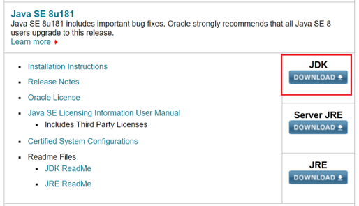

---

### Install Spark On Windows

Step 2:  Go to <a href="http://spark.apache.org/downloads.html">the Spark website</a> and download a pre-built Spark binary.

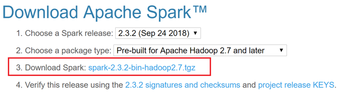

You can unzip this .tgz file using a tool like 7-Zip.

---

### Install Spark On Windows

Step 3:  <a href="https://github.com/steveloughran/winutils/blob/master/hadoop-2.8.3/bin/winutils.exe">Download WinUtils</a>.  This is the 64-bit version and should be 110KB.  There is a 32-bit version which is approximately 43KB; it will **not** work with 64-bit Windows!  Put this exe somewhere like C:\spark.

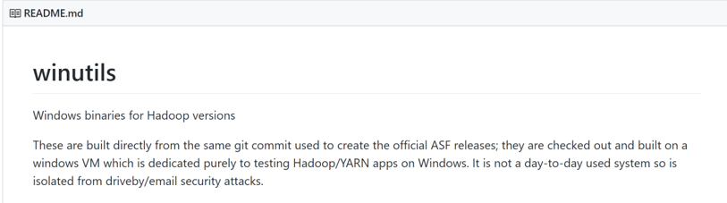

---

### Install Spark On Windows

Step 4: Create c:\tmp\hive and open up permissions to everybody. 

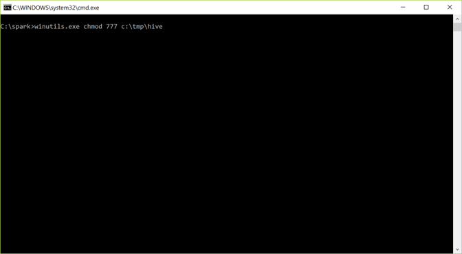

---

### Install Spark On Windows

Step 5:  Create environment variables:

@div[left-50]
SPARK_HOME --> C:\spark 
HADOOP_HOME --> C:\spark (or where winutils is) 
JAVA_HOME --> (where you installed Java)
PATH --> ;%SPARK_HOME%\bin; %JAVA_HOME%\bin;
@divend

@div[right-50]
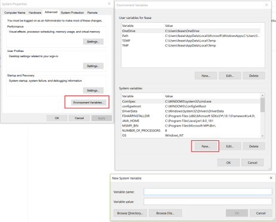
@divend 

---

### Install Spark On Windows

Step 6: Create c:\tmp\hive and open up permissions to everybody. 

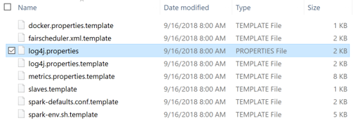

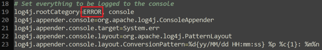

---

### Install Spark On Windows

Step 7:  In the bin folder, run `spark-shell.cmd`.  Type `Ctrl-D` to exit the shell.

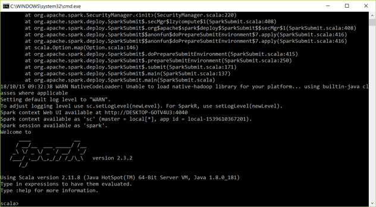

---

### Use A Hadoop Distribution

The <a href="https://hortonworks.com/products/sandbox/">Hortonworks Data Platform sandbox</a> and <a href="https://www.cloudera.com/downloads/quickstart_vms/5-13.html">Cloudera QuickStart VM</a> both include Apache Spark and Apache Spark 2.

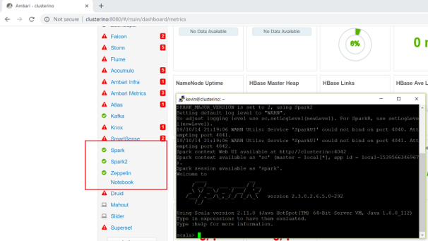

---

@title[Functional Spark]

## Agenda

1. The Origins of Spark
2. Installing Spark
3. **Functional Spark**
4. Our First Examples
5. Spark SQL
6. Databricks Cloud

---

### Why Scala?

Our examples today use Scala.  Spark supports Scala, Python, and Java as first-class languages and R and SQL as second-class languages.  So why Scala?

1. Spark is written in Scala.
2. Functionality comes out in the Scala API first.
3. Scala is much terser than Java while remaining readable.
4. Scala is typically faster than Python.
5. Scala is a functional programming language.

If you prefer Python or Java, that’s fine—but we will use Scala today. 

---

### A Brief Primer on Functional Programming

Important things to know about functional programming today:

* Functions are the key control structure
`def parseLine(line:String) { line.toString().split(",")(3); }`
* Functions can accept functions as parameters
`val rdd = lines.map(parseLine)`
* We can define inline, anonymous functions called lambda expressions
`val rdd = lines.map(x => x.toString().split(",")(3))`

We can build bottom-up solutions iteratively, rather than needing to know everything up front.

---

### Transformations

Transformations take inputs and return an RDD or DataSet.  Transformations are lazily evaluated, making Spark processing more efficient.

|Transformation|Description|Input Rows|Output Rows|
|--------------|-----------|----------|-----------|
|map(func)|Run a function for each row|1|1|
|flatMap(func)|Break a row into 0 or more rows|1|0+|
|filter(func)|Return if row fulfills predicate|1|0-1|

---

### Set Transformations

Certain set operations are allowed with Spark as well.  These behave the same as their SQL counteparts:

* `rdd1.distinct()`
* `rdd1.union(rdd2)`
* `rdd1.intersection(rdd2)`
* `rdd1.subtract(rdd2)` – Akin to the `EXCEPT` operator in SQL
* `rdd1.cartesian(rdd2)` – Cartesian product (`CROSS JOIN` in SQL)

Warning:  set operations can be slow in Spark depending on data sizes and whether data needs to be shuffled across nodes.

---

### Actions

Actions take RDDs as inputs and return something other than an RDD or DataSet.  Actions cause Spark to evaluate all transformations and return.

|Action|Description|Input Rows|Output Rows|
|------|-----------|----------|-----------|
|reduce(func)|Execute for each row|N|1|
|fold(zero)(func)|Reduce but with a "zero value"|N|1|
|aggregate(zero)(seqOp,combOp)|Generate output of arbitrary type|N|1|
|collect()|Load the RDD onto one node|N|N|

---

### Intended Use

### More Actions

Actions take RDDs as inputs and return something other than an RDD or DataSet.  Actions cause Spark to evaluate all transformations and return.

|Action|Description|Input Rows|Output Rows|
|------|-----------|----------|-----------|
|count()|Return count of rows|N|1|
|take(n)|Return n elements. Often biased, no order guaranteed|N|n|
|top(n)|Get first n elements|N|n|
|foreach() / for()|Iterate through RDD|N|-|

---

@title[Our First Examples]

## Agenda

1. The Origins of Spark
2. Installing Spark
3. Functional Spark
4. **Our First Examples**
5. Spark SQL
6. Databricks Cloud

---

### Where To Eat?

We will analyze food service inspection data for the city of Durham.  We want to answer the following questions, mainly for Food Service inspections:

1. What is the average score for inspections from the year 2000 onward?
2. What is the average score by year for inspections from 2000 onward?
3. How many inspections do we have total?
4. How many inspections by year for inspections from 2000 onward?
5. How many inspections by report area do we have from 2000 onward?
6. What is the average inspection score for Mobile Food versus Food Service from 2008 onward?

---?image=presentation/assets/background/demo.jpg&size=cover&opacity=15

### Demo Time

---

@title[Spark SQL]

## Agenda

1. The Origins of Spark
2. Installing Spark
3. Functional Spark
4. Our First Examples
5. **Spark SQL**
6. Databricks Cloud

---

### The Evolution of Spark

One of the first additions to Spark was SQL support, first with Shark and then with Spark SQL.

With Apache Spark 2.0, Spark SQL can take advantage of Datasets (strongly typed RDDs) and DataFrames (Datasets with named columns).

Spark SQL functions are accessible within the SparkSession object, created by default as “spark” in the Spark shell.

---

### The Functional Approach

**Functions** provide us with SQL-like operators which we can chain together in Scala, similar to how we can use LINQ with C#.  These functions include (but are not limited to):

* `select()`
* `distinct()`
* `where()`
* `join()`
* `groupBy()`

There are also functions you might see in SQL Server like `concat()`, `concat_ws()`, `min()`, `max()`, `row_number()`, `rank()`, and `dense_rank()`.

---

### Queries

**Queries** are exactly as they sound:  we can write SQL queries.  Spark SQL strives to be ANSI compliant with additional functionality like sampling and user-defined aggregate functions.

Spark SQL tends to lag a bit behind Hive, which lags a bit behind the major relational players in terms of ANSI compliance.  That said, Spark SQL has improved greatly since version 1.0.

---

### Querying The MovieLens Data Set

GroupLens Research has made available their MovieLens data set which includes 20 million ratings of 27K movies.

We will use Apache Spark with Spark SQL to analyze this data set, letting us look at frequently rated movies, the highest (and lowest) rated movies, and common movie genres.

---?image=presentation/assets/background/demo.jpg&size=cover&opacity=15

### Demo Time

---

@title[Databricks Cloud]

## Agenda

1. The Origins of Spark
2. Installing Spark
3. Functional Spark
4. Our First Examples
5. Spark SQL
6. **Databricks Cloud**

---

### Databricks UAP

@div[left-50]
Databricks, the commercial enterprise behind Apache Spark, makes available the Databricks Unified Analytics Platform in <a href="https://databricks.com/aws">AWS</a> and <a href="https://databricks.com/product/azure">Azure</a>.  They also have a <a href="https://community.cloud.databricks.com/">Community Edition</a>, available for free.

@divend

@div[right-50]
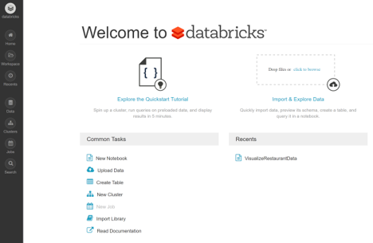
@divend 

---

### Databricks UAP

@div[left-50]
Clusters have 1 node and 6 GB of RAM, running on spot instances of AWS.  Occasionally cluster creation will fail if the spot price is too high; if you get an error, try again as prices change quickly. 

Data sticks around after a cluster goes away, and limited data storage is free. 
@divend

@div[right-50]
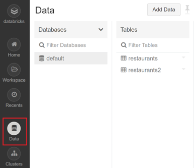
@divend 

---

### Databricks UAP

Create a Zeppelin notebook and attach it to a running cluster. Notebooks stick around after the cluster goes away.

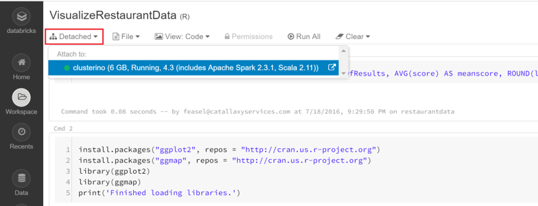

---

### Databricks UAP

Zeppelin comes with a good set of built-in, interactive plotting options.

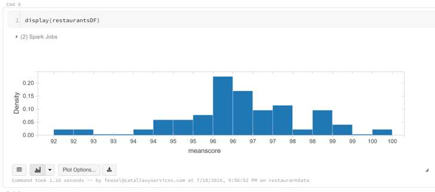

---

### Databricks UAP

Your cluster terminates after 2 hours of inactivity. You can also terminate the cluster early.

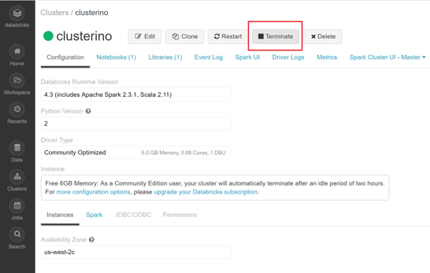

---

@title[What's Next]

### What's Next

In today’s talk, we scratched the surface of Apache Spark.  From here, there are a number of areas within the Spark platform worth further investigation, including:

* MLLib, a library for machine learning algorithms built into Spark
* SparkR and sparklyr, two R libraries designed for distributed computing
* GraphX, a distributed graph database 
* Spark Streaming, allowing “real-time” data processing

The Databricks Unified Analytics Platform (either Azure or AWS) is a great product offering and an easy way to dig into the Spark platform.

---

### Wrapping Up

To learn more, go here:  <a href="https://csmore.info/on/spark">https://CSmore.info/on/spark</a>

And for help, contact me:  <a href="mailto:feasel@catallaxyservices.com">feasel@catallaxyservices.com</a> | <a href="https://www.twitter.com/feaselkl">@feaselkl</a>
